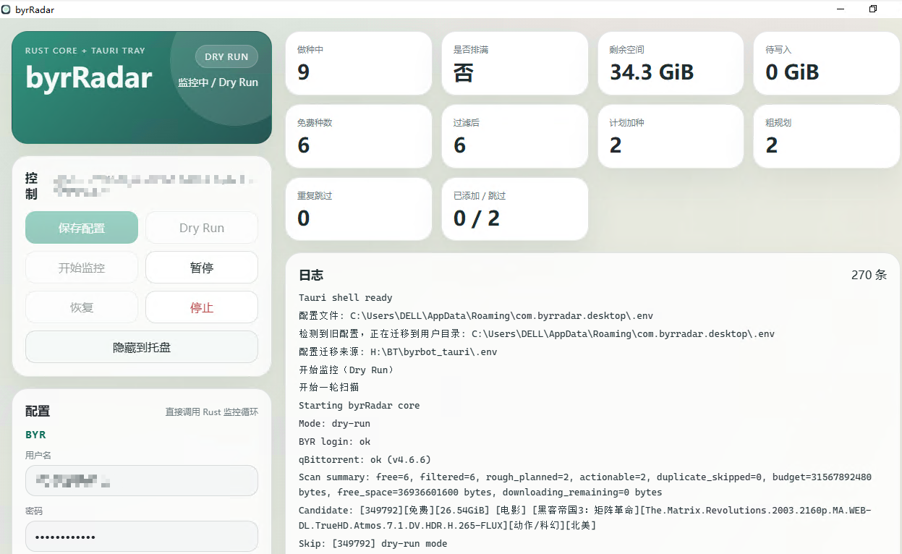

# byrRadar

`byrRadar` is a Windows desktop client for monitoring BYR free torrents and handing them off to qBittorrent with a cleaner workflow than a terminal bot.

It focuses on the practical loop:

- log in to BYR
- scan current free torrents
- evaluate disk budget and active download pressure
- skip duplicates before adding
- push actionable torrents into qBittorrent
- stay available in the tray instead of getting in your way



## Why This Exists

Most automation around BYR freeleech workflows feels like a script you tolerate. `byrRadar` is trying to be the version you actually want to keep running:

- a real desktop UI instead of a terminal-only process
- Rust core logic for the actual scan / plan / qB integration
- Tauri shell for tray behavior and a lightweight desktop footprint
- visible planning stats so you can see why something was added or skipped

## What It Does

- Logs into BYR using the current Rust client flow
- Connects to qBittorrent Web API
- Scans the default BYR torrents page for free torrents
- Filters and prioritizes candidates using current planner rules
- Reserves space against free disk space and in-progress downloads
- Detects duplicate torrents before the actual add step
- Shows live logs, queue pressure, and planning numbers in the UI
- Supports tray-based background use on Windows

## Current Status

This repository is already usable as a desktop client.

What is solid now:

- Tauri desktop shell
- Rust monitoring core merged into one repo
- config stored in user space instead of the install directory
- duplicate preflight handling
- portable `release` executable builds cleanly

What is still intentionally unfinished:

- explicit page / sort parameters instead of relying on BYR default first-page behavior
- richer promo type support beyond the current freeleech-focused path
- fully reliable installer bundling in restricted network environments

## Stack

- `Rust` for BYR + qBittorrent logic
- `Tauri 2` for desktop packaging and tray integration
- `Vanilla JS + CSS` for the UI

## Requirements

- Windows
- A valid BYR account
- qBittorrent with Web UI enabled
- Network access to `https://byr.pt/`

## Quick Start

### 1. Install dependencies

```powershell
cd H:\BT\byrRadar
npm install
```

### 2. Start the app in development mode

```powershell
cd H:\BT\byrRadar
npm run dev
```

### 3. Configure the app

The app stores config in:

```text
%AppData%\com.byrradar.desktop\.env
```

On first launch it will also try to migrate an older local `.env` if one exists.

Required values:

- `BYRBT_USERNAME`
- `BYRBT_PASSWORD`
- `QBITTORRENT_HOST`
- `QBITTORRENT_USERNAME`
- `QBITTORRENT_PASSWORD`
- `QBITTORRENT_DOWNLOAD_PATH`

Optional values:

- `DOWNLOAD_BUDGET_GB`
- `INCLUDE_CATEGORIES`

## Build

Reliable local release executable:

```powershell
cd H:\BT\byrRadar\src-tauri
cargo build --release
```

Output:

```text
src-tauri\target\release\byrradar.exe
```

Tauri bundle build:

```powershell
cd H:\BT\byrRadar
npm run build
```

Depending on the machine, installer bundling may require WiX / NSIS tooling and unrestricted tool downloads.

## Project Layout

```text
byrRadar/
├─ app/                # packaged frontend assets
├─ screenshots/        # README assets
├─ src-tauri/
│  ├─ src/
│  │  ├─ byr_client.rs
│  │  ├─ qb_client.rs
│  │  ├─ planner.rs
│  │  ├─ runner.rs
│  │  └─ main.rs
│  └─ tauri.conf.json
└─ README.md
```

## Roadmap

- Make BYR list fetching explicitly control sorting and page selection
- Expand candidate selection beyond the current freeleech-only focus
- Improve packaging so installer generation is less toolchain-sensitive

## Notes

This project is aimed at legitimate personal automation around your own BYR and qBittorrent setup. You are responsible for how you use it and for staying within the rules of the services involved.
